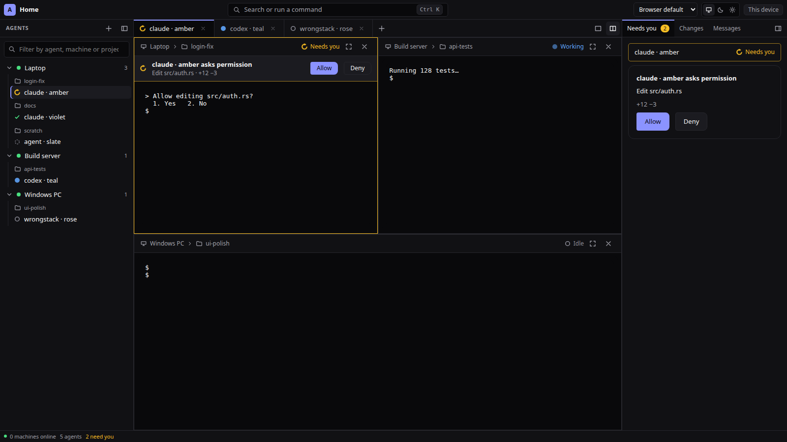
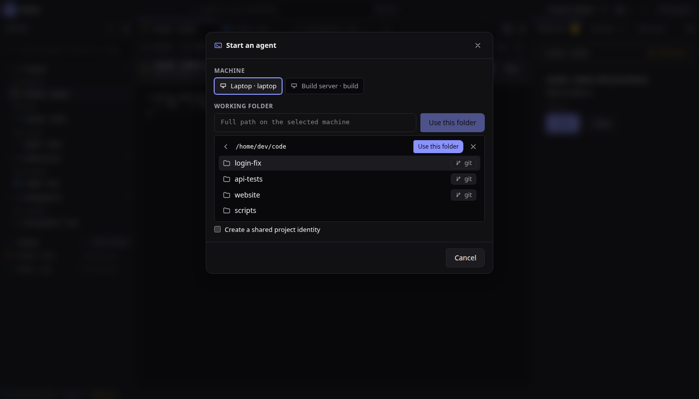
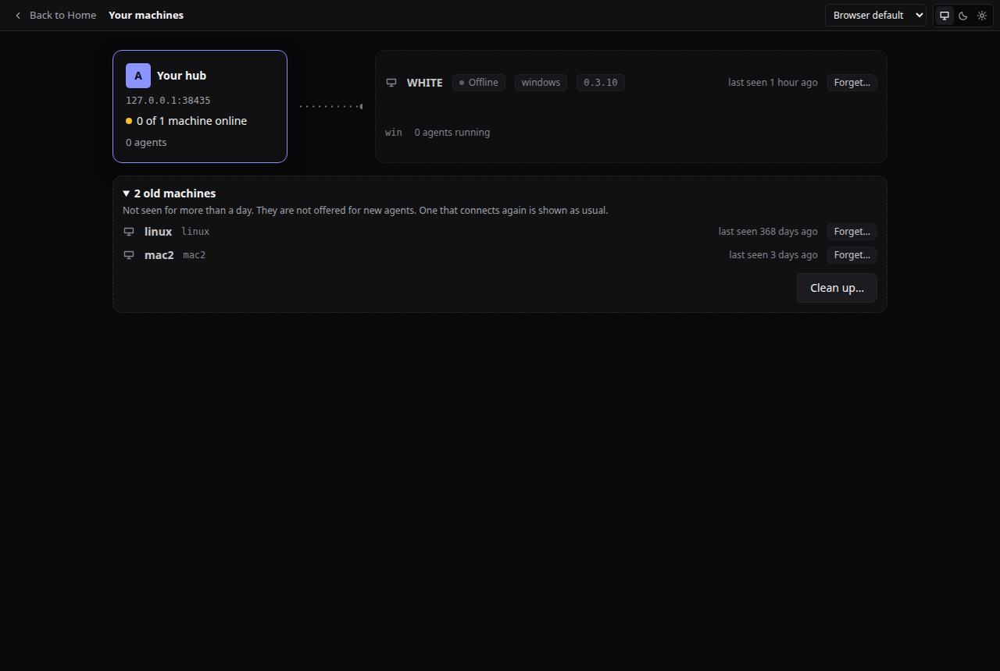
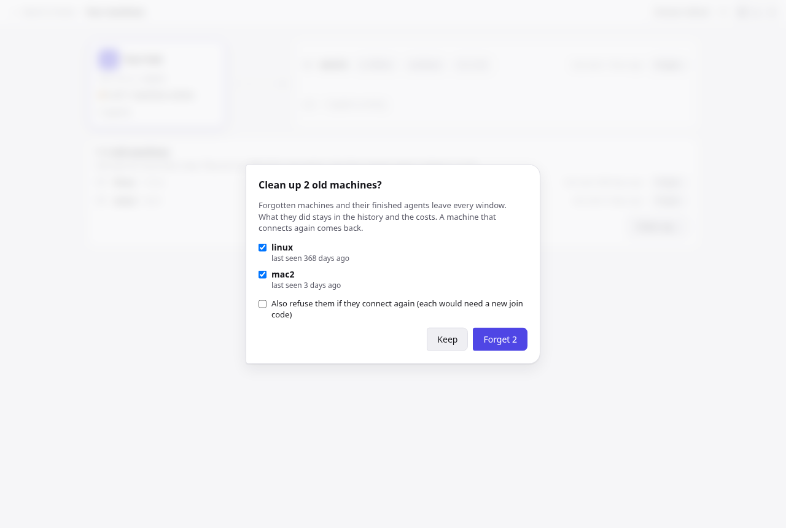

# Main window

## Browsing folders

**Browse folders** under the working-folder field opens a list of the machine's sub-folders (`directory.list`, ADR-0053; it starts in the home folder, or the typed path when there is one). Click a folder to step into it, the arrow goes up one, a Git project is marked, and **Use this folder** continues as if the path had been typed (the machine still resolves and shows it before anything starts). A machine without the command keeps the typed path.

## Closed agents

An agent whose process is gone moves from its folder to **Closed**, below the machines, with how long ago it ended; a failed one is marked. Opening it shows a summary (how it ended, when, for how long, folder and branch, files left behind with Review/History/Files, tokens and cost), **Start an agent** on this machine and **Remove from the list**. **Clear closed** removes them all. **Remove from this list** is remembered in this browser only; **Remove for everyone** asks the hub to forget the agent (`agent.forget`, ADR-0053): every client stops listing it, while its earlier events and its cost stay in the hub's record. A hub without the command answers with an error and the agent is only hidden here.

## Hub and machines

`#/machines` draws the hub with a live link to every machine it knows (animated when connected, dotted when not), a card per machine (state, system, node version, agents, terminals, memory, cost, when it was last heard, or for an offline one "last seen", ADR-0070) and the agents running there as chips. An offline machine also shows "last seen" on its row in the agent list and in its tooltip.

**Old machines** (ADR-0073): a machine not seen for more than a day is listed apart, folded, under **n old machines**, and is not
offered for new agents. An offline machine has **Forget…**, and the old ones have **Clean up…**: one dialog lists them, ticked,
with when each was last seen and how many agents were running then, and one box also refuses them if they connect again (a new join
code is needed then). The hub forgets them for every window (`node.forget`, owner only); what they did stays in the history and the
costs, and a machine that connects again comes back with the agents it still runs. `agora hub machines` does the same from the hub's
machine.

## Layout (editor-style, 2026-11-12)

The window is laid out like an editor, with the terminal as the content. At most two side panels are visible (visual-language.md); each hides with its button.

- **Title bar:** product mark, the search and command field (Ctrl+K), connection state, language, device.
- **Left, Agents:** a tree of machine, folder, agent. A machine row has a start button (visible on hover and focus). Agents show their state shape, shared-folder label and changed-file count. The project filter and search narrow the tree. Clicking an agent opens it as a tab; clicking the one in front closes it.
- **Middle, panes (ADR-0068, [layout.md](layout.md)):** a layout of panes and tab groups: the Fleet tab and one tab per watched agent by default, or 1x2, 2x1, 2x2, 3x2 and one large with three small from the **Layout** menu in the title bar, saved by name, exported and imported. Panes are split, resized by their dividers, dragged onto each other, maximized and restored; a pane can follow what needs you or the selected agent. Above each terminal: machine, folder and branch, changed files, cost, state, History, Files, Full size, and the copyable agent address.
- **Right, Details:** an icon rail that is always visible (also on a narrow window), with Needs you (badge with the count; opens first whenever something needs you), Changes (count), Board, Messages and Spent (the last two appear only when there is something). Each icon has a tooltip with its name and shortcut (Alt+Shift+1 to 5; the same key closes the panel). The subject opens beside the rail and is part of the layout on a wide window, a drawer over the content on a narrow one (Esc closes it); whether it is open and which subject is remembered on this device. The Needs you icon is always there, on Home too: it is never hidden, even though the Fleet console lists the same requests.
- **Tab rows that do not fit** (the pane tabs): they scroll sideways, the edge with more fades, the tab in front is kept in view, and a **More tabs** menu lists the tabs that are cut off.
- **Group by** (the agent list and the Fleet console share one choice, remembered on this device): Machine, Project, Agent (kind) and State. A project is the hub's machine-independent project id, so the same project open on several machines is one group, marked **Same project · n machines** (on tiles, in the list and on the group), with a gentle hint when agents on two or more machines have changes in it. Folders that merely share a name are never merged; an agent without a project id is grouped only with the same folder on the same machine.
- **Agent header** (agents with a chat): one row with a Model and a Mode menu (only what the agent reported over ACP; no effort picker is shown because no effort option is reported), context fill, elapsed time (when this window saw it start) and the cost the agent reported.
- **Acts freely badge:** an agent started so that it acts without asking shows a warning sign and the short label **Acts freely** (the sign alone in a tab); the whole explanation is the tooltip, its accessible name, and is shown on focus or tap where the badge is not inside another control.
- **Command palette extras:** **Machine: ⟨name⟩** (the machines page, at that machine), **Project: ⟨name⟩** (shows that project's agents; not on a phone), **Allow a new machine to join** (brings the existing window for new machines into view on Home; its own button still opens it and each join is still approved with the number), **Lock** (only when a screen password is set; the same action as the title bar's Lock) and **Settings** (This device). Entries are names and navigation: none carries a secret and none answers a request by itself.
- **Status bar:** machines online, agents, how many need you, cost so far.
- **Home, the fleet console ([fleet-console.md](fleet-console.md)):** a window nobody has arranged opens on a **Fleet** tab in front of the agents' tabs: five live counts (needs you, working, finished, failed, machines online) that filter the tiles, what needs you first with Allow and Deny in the row for a plain yes or no, then every agent as a tile grouped by machine or by project. With no machine, no agent or no link it teaches the next step instead.
- **One terminal in several windows:** a terminal open in more than one window (two machines, or a phone and a laptop) has the size of the smallest of them, so it fits every one; a bigger window shows it at its top left with a thin line where it ends, and gets its own size back as soon as the smaller window closes it. A terminal client on the machine itself still sets the size it wants (ADR-0072; docs/specs/protocol.md, "Shared terminal size").
- **Phones:** a single column instead of this window: the same five counts, what needs you, machines and agents, then one agent (ADR-0067 rung 2, [phone.md](phone.md)). A tablet keeps this window; on a touch screen its terminals get the key bar.

The older three-column description below stays valid for what each area holds.

Agreed layout (2026-11-06). Three columns plus a top bar, shown in the **Focus** layer.

Default state follows `visual-language.md`: the window opens on **Home** (Glance: attention strip + fleet of
live agent tiles). Selecting an agent opens this three-column layout. The right column shows one panel at a
time (Files, Changes, Team chat, Usage as tabs) and can be collapsed; the Machines list is a filter, not a
permanent section. Labels below use internal terms; the UI uses the vocabulary in `visual-language.md`.

## Needs you, loudly

A blocked agent is never invisible. The Needs you tab, the fleet console, the status bar count, the tab title and (on a phone) the bar at the
bottom always show it; nothing below can hide them. On top of that, **This device** chooses how loud the window is (kept in this browser
only, default **A card over the window**): a card, a small banner only, or nothing extra.

- **The card** (`AttentionLayer`) opens for a request: for a plain yes or no that is shown whole (the fleet console's `decidableInline`) it has
  **Allow** and **Deny**; for anything else (a request to start an agent, settings, long, several-line or structured text, a hidden
  character, a machine asking to join) it says what and has only **Review**, which goes to the full card. It never cuts what is asked, and it
  is never offered for an agent that waits in its terminal with no request open (the banner and the list carry that). On a phone the bar
  at the bottom does this job ([phone.md](phone.md)), so there is no card.
- **It never takes the keyboard.** It opens only while the window is the one in front and the person is not typing: not with the cursor in
  a field or a terminal, and not within 1.5 s of the last key typed into one. Otherwise it waits, the banner (bottom right, not modal)
  shows how many wait, and it opens when the person stops. A card that is open stays what it is; a newer request waits behind it
  ("1 more needs you after this").
- **It cannot be clicked by accident.** Allow and Deny do nothing for 600 ms after the card appeared or anything it shows changed (the
  request, the agent's name, the machine's name; the same dwell as the phone bar, restarted by every change), after the person comes
  back to the window (focus, or the tab shown again) and after the link comes back. Nothing is focused when it opens (Enter answers
  nothing), and the link must be up. A request is answered once: after Allow or Deny its buttons stay dead (the card says the answer was
  sent and offers Review). The card is an alert dialog and says "An agent needs you" in an assertive live region when it opens; a long
  name is cut and wraps, so the buttons are never pushed out of view.
  **Esc, a click outside the card and Later all mean Later**: nothing is sent, and it comes back only through the banner. Nothing about a
  request is stored anywhere; only the two choices of This device are.
- **Notifications** (only after the person presses **Turn on notifications** in This device; the window never asks on its own): while the
  window is in the background, one system notification says "An agent needs you"; an option adds the agent's and the machine's name, only when it is a plain name
  (letters, digits, spaces, `. _ - @`, at most 24 characters, one request) and otherwise the generic text. A request that arrived while the
  window was in front and is still waiting when it goes to the background is told about then. It
  never carries what is asked (a request's text, a command, a path, a prompt). A burst is one notification, plus one more with the final
  count when 15 s have passed; a new one replaces the old. Pressing it brings the window forward and opens the card (or, with Banner
  only, the list). **Nothing extra** sends none. The tab title shows `(n)` and the app badge the count, whatever the choice.

Screenshots in both themes: `docs/screenshots/needs-you-modal/`. Tests: `apps/web/src/components/AttentionLayer.test.tsx`.

## Top bar
- Scope selector (all machines or one project); connected node count.
- Approvals indicator with count; opens the approvals queue (`approvals.md`).
- Global kill switch (stop all agents) behind a confirmation.

## Left column: navigation
- **Projects** tree. Each project expands to its agents and non-agent terminals (servers, tests, logs).
  - Agent row: kind, instance number when several of the same kind exist, state badge
    (`working`, `blocked`, `done`, `idle`, `unknown`).
  - Project row shows a rollup of the most urgent agent state.
- **Machines** list: node name, OS, connection status.

## Center: selected item
- Header: agent name, machine, selected folder/branch.
- Mode toggle per agent: **Terminal** (native agent UI) and **Chat** (structured view, L2/L3 only).
- Inline approval banners for blocked agents.

## Right column: project context
- **Files**: lazy tree of the project checkout on the selected agent's node. Badges for added/modified;
  lock icon for files under a lease.
  Built today (web, read-only; `apps/web/src/components/FilesView.tsx`), in the Files window and in a pane ("Show… → This
  agent's files", beside its terminal):
  - The tree marks each changed file with its status letter, and each folder that holds one with a dot. "N changed" lists only
    the changed files, and a name filter searches every file listed so far.
  - Open files are tabs. The path bar's folders open the tree down to the file.
  - The file shows with line numbers and marks in the gutter (added, changed, removed above), read again whenever the node's
    count of changed files moves. The text is drawn a screenful at a time.
  - Ctrl F finds in the file (a query with a capital letter matches case exactly; otherwise every case form matches, Turkish `i`/`İ`
    and `ı`/`I` included). `/` filters the tree. The whole file can be copied.
  - The tree is one Tab stop: arrows move between the items shown, Right opens a folder and goes into it, Left goes back up and
    closes it, Home and End go to the ends.
  - When the changes are larger than 512 KiB, the files after the cut carry no mark, and the tree says so with the machine's count.
  - In a narrow pane the tree sits above the file.
  - Syntax colours (highlight.js, loaded on demand) for files up to 128 KiB in about 25 languages, chosen by file name.
  - Not built yet: a lock mark on a file in the file browser (the task board lists the leases an agent holds), editing.
- **Changes**: workspace diff summary (+/−); shared folders appear once and have a shared-folder label. No per-agent attribution is implied. Opens the review screen (`review.md`).
- **Mesh**: project channels with unread counts; task board progress (`task-board.md`).
- **Usage**: tokens and estimated cost for the selected agent and project (`../design/usage-and-cost.md`).

## Other screens
`review.md`, `approvals.md`, `task-board.md`, `onboarding.md`, `settings.md`.

## Principles
See `experience.md`. Command palette, attention flow, and fleet view are part of this window.

## Start an agent (ADR-0052)

One window: **Machine** chips, then **Working folder** (a known folder in one click, or a typed path), then **Agent** chips and options. Choosing the folder shows the resolved folder, branch and the rule that nothing is changed before anything starts.

Choose an online **Machine**, a known **Project** or another **Working folder** on that machine, then **Use this folder**.
The canonical folder is shown before choosing an agent and starting it. Default launch uses exactly this folder; it does not
create a branch or working copy. A Git folder offers **Create an isolated working copy** as an unchecked option. Non-Git
folders offer terminals/chat and files without Git history or diffs. Newly selected folders appear without restarting the machine.

**Create a shared project ID** explicitly writes `.agent-project.json`. Explain that committing/copying this file groups copies
on other machines; it does not sync source files. A changed previously confirmed ID requires an explicit association checkbox.
The project filter groups the same identity across machines, retaining each machine/path and its sessions. Several agents in
one folder display **Shared folder**. If a machine lacks directory support, show an update message and keep the form open.
Directory actions require a browser device trusted on the machine; the node verifies its exact signed selection.

## Addresses and machine identity

Machine host names are display labels; enrollment IDs remain the identity used for navigation, project-machine counts and
online status. Two machines with the same host name stay separate. Their IDs appear beside the name and in the launch selector
and machine details. A project shared by two enrolled IDs counts as two machines even when both host names match.

Each live agent pane and focused view shows its hub-qualified **Agent address** (`<node>/<agent>`) with an explicit copy action.
Copy the actual routing identifier, never construct it from the host name. The address remains selectable when clipboard access
is unavailable and the UI explains manual copying. Demo tiles without an enrolled identity offer no fictitious address.
